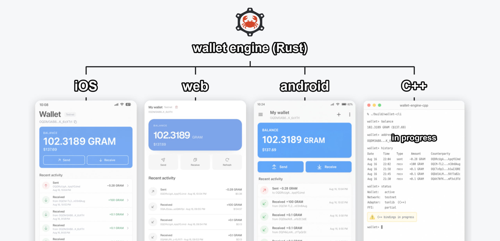
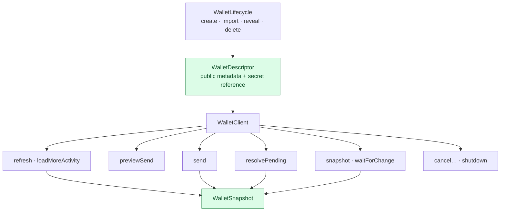
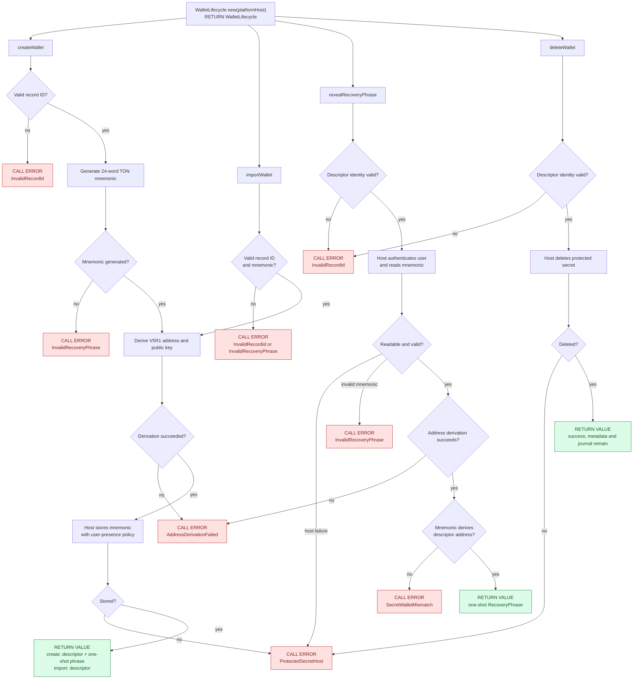
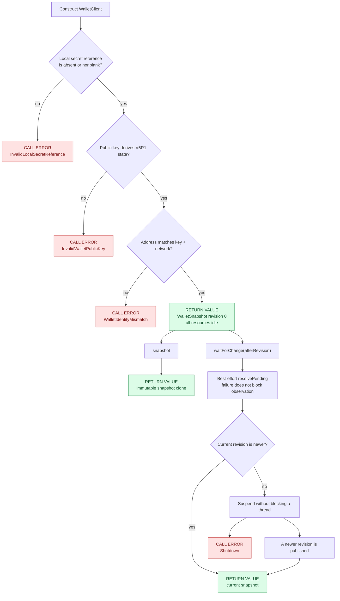
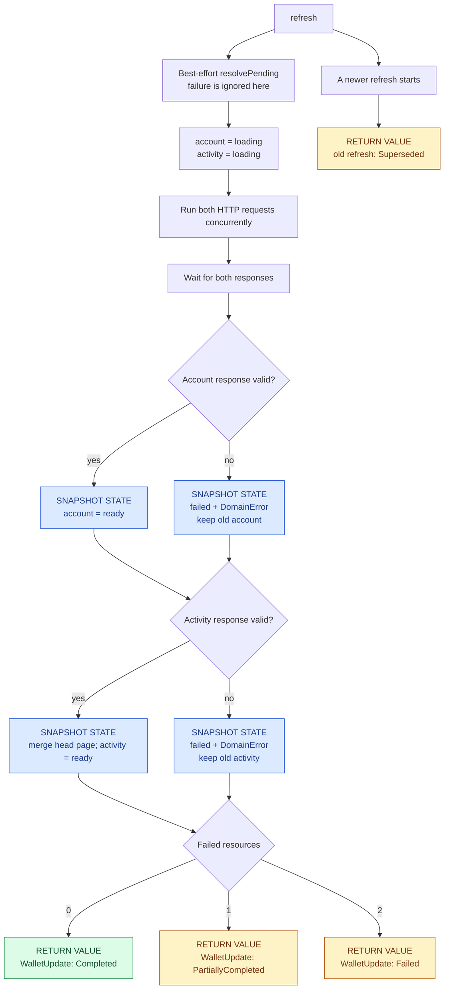
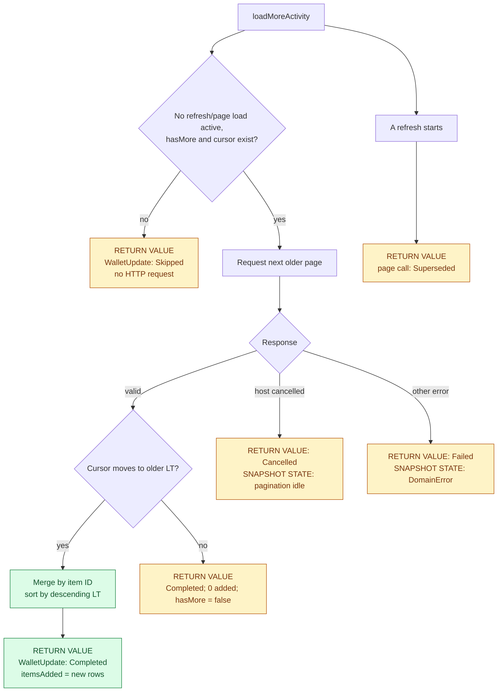
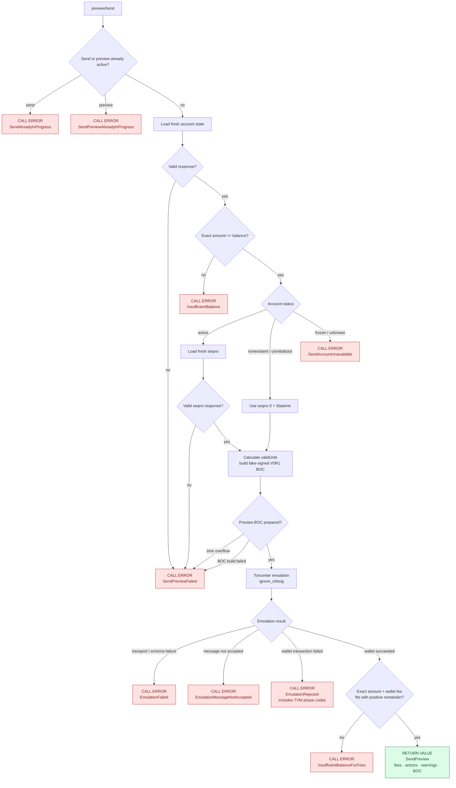
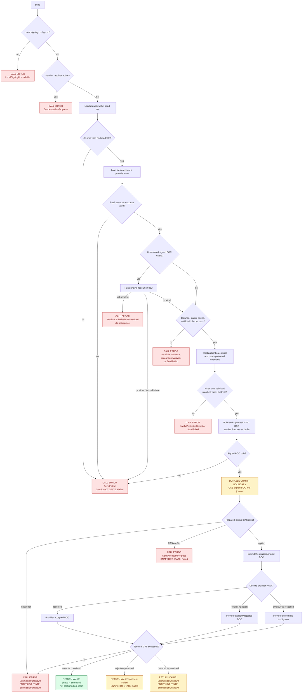
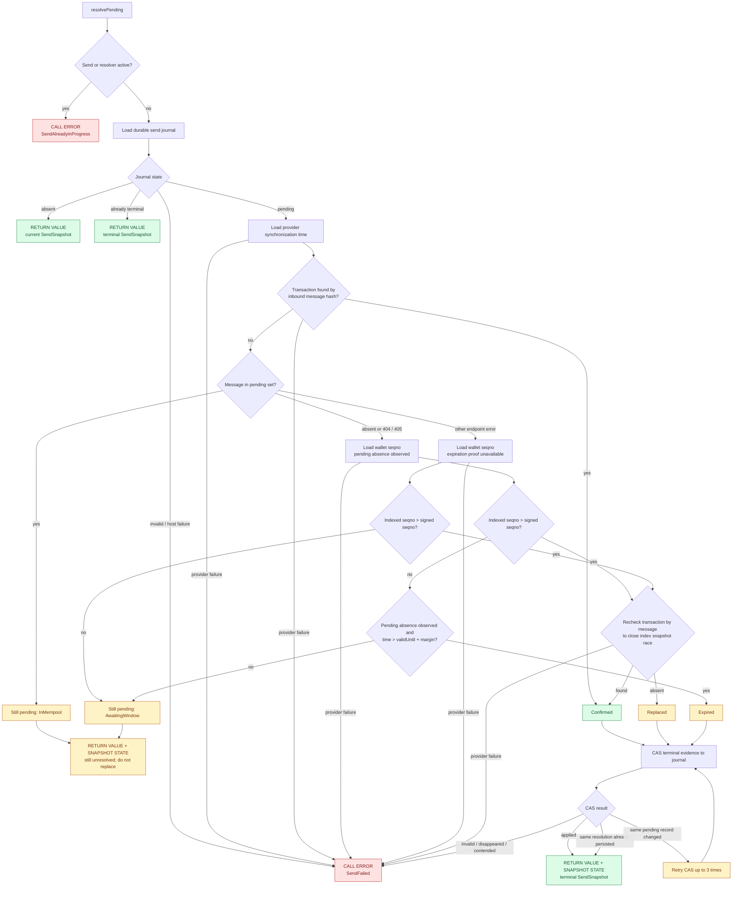
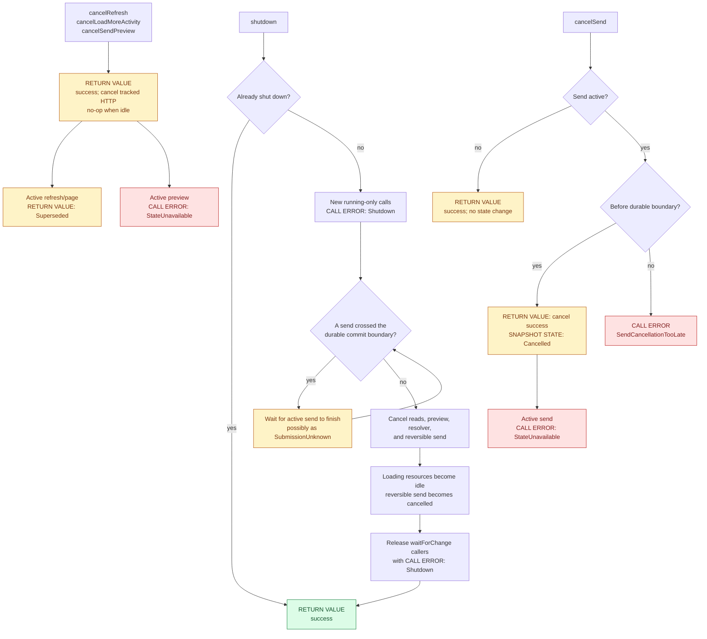

# Wallet Engine

Wallet Engine is a Rust library for TON wallet applications. It gives Swift,
Kotlin, and TypeScript applications the same wallet behavior.

Use Wallet Engine to:

- create and import V5R1 wallets.
- protect recovery phrases with platform storage.
- read balances and transaction history.
- load additional history pages.
- sign and submit transfers.
- observe immutable wallet snapshots.
- cancel active wallet operations.

The engine supports mainnet and testnet. The host application supplies network
access and platform security services.

## Choose your platform



### Swift

Generate the Swift source and its C module:

```shell
just bindings-swift
```

Then read [SWIFT.md](SWIFT.md) for the generated paths and Apple integration
requirements.

For a complete SwiftUI integration, see the
[Swift wallet example](examples/swift/README.md). It runs on macOS and iOS and
implements the HTTP, Keychain, and journal callbacks required by the engine.

### Kotlin and Android

Generate the Kotlin source:

```shell
just bindings-kotlin
```

Build the Android libraries:

```shell
just build-android
```

Then read [KOTLIN.md](KOTLIN.md) for Android packaging and runtime
dependencies.

For a complete Jetpack Compose integration, read the
[Android wallet example](examples/android/README.md). The example implements
the HTTP, Android Keystore, and journal callbacks that the engine requires.

### TypeScript and WebAssembly

Generate the browser WebAssembly package:

```shell
just bindings-wasm
```

The repository also contains the source of the high-level
`@ton/wallet-engine` TypeScript package. It provides a browser HTTP host,
IndexedDB journal storage, wallet lifecycle methods, and wallet client methods.

Read [WASM.md](WASM.md) for browser setup and security requirements.

For a small React integration, see the
[web wallet example](examples/web/README.md). It creates a V5R1 testnet wallet,
shows the recovery phrase, refreshes the balance and activity, and loads more
history. The engine integration is kept separate from the interface code.

### C

Generate the C ABI header:

```shell
just bindings-c
```

Build the native library and run the C11 ABI tests:

```shell
just test-c
```

The ABI lives in the separate `c-bindings` crate, and its header
is generated with `cbindgen`. See [the C example](examples/c/README.md) for
build and run commands.

Except for the checked-in C ABI header, this repository does not track generated
bindings. Generate them from the same revision that you use to build the Rust
library.

## Rust

For a native Rust integration, see the
[Ratatui wallet example](examples/tui/README.md). It implements both host
interfaces directly in Rust and provides create, import, refresh, history,
send, persistence, and delete flows.

This repository does not track generated bindings. Generate them from the same
revision that you use to build the Rust library.

### Rust tests

Install a current Acton CLI that supports `acton localnet`.

`cargo nextest run` executes unit and scenario tests in parallel. Localnet
scenarios start temporary Acton nodes on free loopback ports. The scenarios
cover wallet deployment, transfers, refresh, pagination, cancellation, and
concurrent chain changes.

If Acton is not in `PATH`, set the path explicitly:

```shell
WALLET_ENGINE_ACTON_BIN=/path/to/acton cargo nextest run --locked
```

Use `just test` to also run C boundary tests and Rust documentation tests.

## Integration model

Wallet Engine owns the wallet state machine. Your application implements two
asynchronous host interfaces.

| Interface | Your application provides |
| --- | --- |
| `WalletHttpHost` | Bounded HTTP requests and cancellation by request ID |
| `WalletPlatformHost` | Protected secrets and durable journal storage |

The host callbacks let the same Rust engine run on Apple, Android, and browser
platforms. The engine does not own platform networking or protected storage.

## Basic wallet flow

1. Implement `WalletHttpHost` and `WalletPlatformHost` for your platform.
2. Create `WalletLifecycle` with your platform host.
3. Create or import a wallet.
4. Store the returned wallet descriptor in your application storage.
5. Show the recovery phrase only in the required user flow.
6. Create `WalletClient` with the descriptor data and both host objects.
7. Call `refresh()` to load the initial wallet state.
8. Publish the returned snapshot in your user interface.
9. Call `waitForChange` to receive later snapshot revisions.
10. Call `shutdown()` before you discard the client.

The wallet descriptor contains the stable application record ID, address,
Ed25519 public key, network, and protected-secret reference. Your application
needs these values after a restart. The public key is not a secret.

## Wallet flow diagrams

The diagrams below cover every public wallet flow. Terminal nodes use both a
text prefix and a color, so their meaning does not depend on color alone:

- `CALL ERROR` means a thrown Swift/Kotlin error or a rejected TypeScript
  promise.
- `RETURN VALUE` means the method completed normally, even when its outcome or
  phase is not successful.
- `SNAPSHOT STATE` means the method published observable wallet state.
- green is successful, red is a call error, blue is snapshot state, and yellow
  needs explicit handling but is safe to return.



Operations that require a running client can return `Shutdown` or
`StateUnavailable`. Operations that allocate request IDs or revisions can
return `IdentifierExhausted`. Provider flows can return
`InvalidProviderBaseUrl` while constructing a request. These shared guards are
omitted below unless they materially change a flow.

### Create, import, reveal, and delete

Recovery words exist only across the lifecycle and protected-storage boundary.
They are never stored in `WalletDescriptor` or `WalletSnapshot`.



### Construct and observe a client

`WalletSnapshot` is immutable. Each published change creates a new revision;
observers never receive a mutable view of engine state.



A public-key-only client has no `localSecretRef`. It can refresh, paginate,
preview, observe, and resolve. Only `send` returns `LocalSigningUnavailable`.
`snapshot()` remains readable after shutdown; a suspended `waitForChange`
returns `Shutdown`.

### Refresh account and activity

Account and activity requests run concurrently. The engine waits for both, then
publishes the account and activity resource states separately. An HTTP or
provider failure is stored as `ResourceState.error`; it does not turn the whole
call into a thrown `WalletClientError`.



`DomainError` classifies transport, provider protocol, rate limit,
cancellation, and host-policy failures and includes retry advice.

### Load more activity



### Preview a transfer

Preview uses fresh chain state and a fake signature. It never reads the journal
or recovery phrase, and its BOC is never reused by `send`.



Child transaction failures can make `traceSucceeded` false without rejecting
the preview. Only failure of the source wallet transaction produces
`EmulationRejected`.

### Sign and submit a transfer

The durable journal write is the critical boundary. Before it, cancellation is
safe. After it starts, the exact signed BOC may survive a crash or reach the
provider, so an uncertain result must remain unresolved.



An explicit provider rejection becomes a definite `SendResult` with phase
`failed` only after the terminal journal CAS succeeds. A transport failure
after submission is not definite: it produces `submissionUnknown`, and the
application must resolve it before signing another payment.

### Resolve a durable pending send

`resolvePending` never unlocks the mnemonic and never signs. It evaluates
evidence from strongest to weakest so a confirmed message is not mistaken for
a replacement merely because both advance the wallet seqno.



`refresh` and `waitForChange` make a best-effort attempt to recover a durable
pending send and ignore resolver failure. A later `send` runs the same evidence
algorithm but reports failure and refuses to sign while the old message remains
unresolved.

### Cancel and shut down



## Wallet state

`WalletSnapshot` is the only state that the user interface needs. It contains:

- the account balance and status.
- recent activity and its pagination cursor.
- independent states for account, activity, and pagination resources.
- the latest send state.
- a monotonic revision number.

A refresh can complete partially. Read each resource state before you replace
previous data or show an error.

Use `waitForChange(afterRevision:)` on Swift. Use
`waitForChange(afterRevision)` on Kotlin. Both calls wait until a newer snapshot
is available.

## Sending GRAM

Call `previewSend` to show fees, actions, and execution warnings before the
user confirms a transfer. This call does not read the recovery phrase.

The preview is information, not permission to send. A preview failure does not
block `send`.

Chain state can change after the preview. Therefore, `send` never reuses the
preview message, sequence number, or expiration time.

Call `send` after user confirmation. Give it a unique operation ID,
destination, nanogram amount, and wallet secret reference.

Set `sendValiditySeconds` in `WalletClientConfig` according to your product's
submission policy. The engine adds this duration to the synchronization time
from the fresh Toncenter account response. It does not trust the device clock.
A short duration can expire before inclusion. A long duration leaves the
signed message valid for longer.

`previewSend` does these steps:

1. loads a fresh account state and sequence number.
2. builds the complete V5R1 intent from the stored public key.
3. emulates it with a placeholder signature and `ignore_chksig`.
4. returns fees, actions, trace status, and the preview expiration time.

`send` starts a new workflow after confirmation:

1. loads the durable send journal.
2. loads a new account state and sequence number.
3. calculates a new expiration time from the provider synchronization time.
4. requests the protected recovery phrase from the host.
5. makes sure that the phrase belongs to the selected wallet.
6. builds and signs a new V5R1 message in Rust.
7. stores the exact signed BoC in the host journal.
8. submits that BoC to the provider.

The emulation request does not contain the mnemonic or private key. Child
transaction failures remain in `SendEmulation.traceSucceeded`; they do not
automatically block submission because a recipient can reject or bounce.
`SendEmulation.actions` contains the high-level actions returned by Toncenter.
Each action has validated Base64 identifiers, involved accounts, and its
action-specific details as JSON.

`SendPreviewFailed` means fresh state could not be loaded or the fake-signed
message could not be built. `EmulationFailed` means that the emulation service,
transport, or response failed. `EmulationMessageNotAccepted` means that the
current chain state rejected the external message, for example after another
client advanced the wallet seqno. `EmulationRejected` means that the external
message created a wallet transaction, but its compute or action phase failed.
The last error includes the returned TVM phase codes.

Handle every send phase explicitly:

| Phase | Meaning |
| --- | --- |
| `submitted` | Provider accepted the BoC; it is not confirmed on-chain. |
| `failed` | Provider explicitly rejected the request. |
| `submissionUnknown` | The BoC can be accepted, but the result is unknown. |
| `cancelled` | The operation stopped before the durable submission boundary. |

CAUTION: If the phase is `submissionUnknown`, do not create and submit a new
transfer automatically. The first signed message can already be in the
network.

The journal uses compare-and-swap writes. The host implementation must make
these writes durable before it reports success.

## Streaming

Wallet Engine does not contain a streaming API. The host application owns its
stream connection, reconnect policy, and application lifecycle.

The engine also does not reconcile stream events. A host can start a normal
refresh when its product behavior requires new wallet data.

## Security requirements

- Store recovery phrases with the platform protected-storage API.
- Require user authentication according to your product policy.
- Do not log recovery phrases, secret values, or signed BoCs.
- Add a Toncenter credential only when the request origin matches the configured
  Toncenter base URL.
- Enforce the request and response limits from each `HttpRequest`.
- Honor `cancelHttp` for requests that have not completed.
- Store wallet descriptors separately from protected recovery phrases.

The engine clears the secret buffers that it owns. The FFI boundary and the
host language can create additional copies.

The host must limit the lifetime of these copies. The host must clear mutable
byte buffers after each callback. Immutable client strings cannot be reliably
cleared, so release them immediately after the recovery screen closes.

See [Swift](SWIFT.md), [Kotlin](KOTLIN.md), and [WebAssembly](WASM.md) for the
client-specific rules.

## Build from source

The repository pins Rust 1.96.1 in `rust-toolchain.toml`.

Build the release library:

```shell
just build
```

Run all repository checks:

```shell
just check
```

Install the optional repository tools before the first complete check:

```shell
just install-tools
```

Run the bounded Kani proofs for the root Rust crate:

```shell
just kani-setup
just kani
```

Use `just kani-list` to list the available proof harnesses. Kani 0.67 bundles
Rust 1.93, so `verification/kani/Cargo.toml` points a verification-only package
at the production `src/lib.rs`. This keeps the production Rust 1.96.1
requirement intact and verifies the same source code.

Run `cargo xtask --help` to see the binding and Android build commands.

## License

Wallet Engine is available under the Apache License 2.0 or the MIT License.
See [LICENSE-APACHE](LICENSE-APACHE) and [LICENSE-MIT](LICENSE-MIT).
